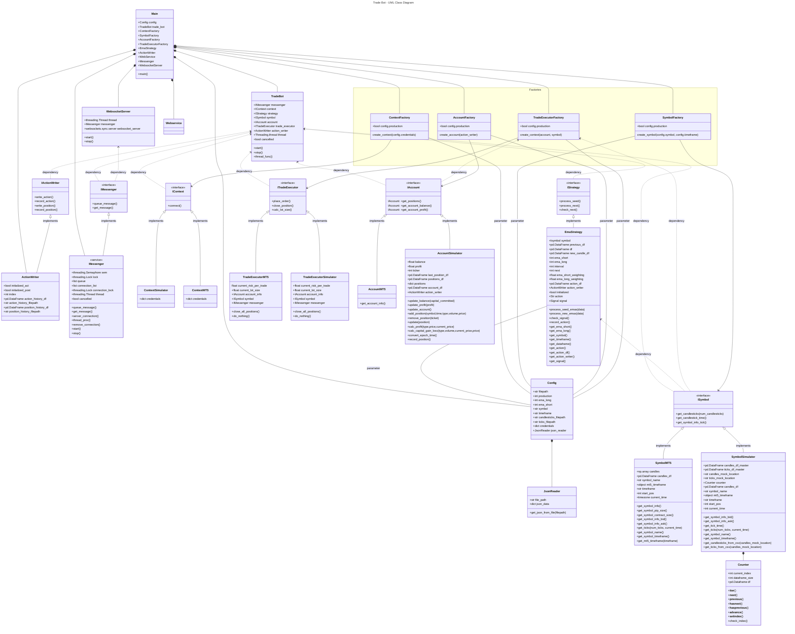

```mermaid
---
title: Trade Bot - UML Class Diagram
---
classDiagram
    class Main {
        +Config config
        +TradeBot trade_bot
        +ContextFactory
        +SymbolFactory
        +AccountFactory
        +TradeExecutorFactory
        +EmaStrategy
        +ActionWriter
        +WebService
        +Messenger
        +WebsocketServer
        +main()
    }

    class TradeBot {
        +IMessenger messenger
        +IContext context
        +IStrategy strategy
        +ISymbol symbol
        +IAccount account
        +ITradeExecutor trade_executor
        +ActionWriter action_writer
        +Threading.thread thread
        +bool cancelled
        +start()
        +stop()
        +thread_func()
    }

    class Config {
        +str filepath
        +int production
        +int ema_long
        +int ema_short
        +str symbol
        +str timeframe
        +str candlesticks_filepath
        +str ticks_filepath
        +dict credentials
        +JsonReader json_reader
    }

    class JsonReader {
        +str file_path
        +dict json_data
        +get_json_from_file(filepath)
    }

    namespace Factories{
        class ContextFactory {
        +bool config.production
        create_context(config.credentials)
        }

        class SymbolFactory {
            +bool config.production
            create_symbol(config.symbol, config.timeframe)
        }

        class AccountFactory {
            +bool config.production
            create_account(action_writer)
        }

        class TradeExecutorFactory {
            +bool config.production
            create_context(account, symbol)
        }
    }
    
    class IActionWriter {
        +write_action()
        +record_action()
        +write_position()
        +record_position()
    }

    class ActionWriter {
        +bool initialized_act
        +bool initialized_post
        +int index
        +pd.DataFrame action_history_df
        +str action_history_filepath
        +pd.DataFrame position_history_df
        +str position_history_filepath
    }

    class IMessenger {
        <<interface>>
        +queue_message()
        +get_message()
    }

    class Messenger{
        <<service>>
        +threading.Semaphore sem
        +threading.Lock lock
        +list queue
        +list connection_list
        +threading.Lock connection_lock
        +threading.Thread thread
        +bool cancelled
        +queue_message()
        +get_message()
        +server_connection()
        +thread_proc()
        +remove_connection()
        +start()
        +stop()
    }

    class WebsocketServer{
        +threading.Thread thread
        +Messenger messenger
        +websockets.sync.server websocket_server
        +start()
        +stop()
    }

    class IContext {
        <<interface>>
        +connect()
    }

    class ContextSimulator {
        +dict credentials
    }

    class ContextMT5 {
        +dict credentials
    }

    class IStrategy {
        <<interface>>
        +process_seed()
        +process_next()
        +check_next()
    }
    
    class EmaStrategy {
        +Isymbol symbol
        +pd.DataFrame previous_df
        +pd.DataFrame df
        +pd.DataFrame new_candle_df
        +int ema_short
        +int ema_long
        +int interval
        +int next
        +float ema_short_weighting
        +float ema_long_weighting
        +pd.DataFrame action_df
        +ActionWriter action_writer 
        +bool initialized
        +Str action
        +Signal signal
        +process_seed_emas(data)
        +process_new_emas(data)
        +check_signal()
        +record_action()
        +get_ema_short()
        +get_ema_long()
        +get_symbol()
        +get_timeframe()
        +get_dataframe()
        +get_action()
        +get_action_df()
        +get_action_writer()
        +get_signal()
    }

    class ISymbol {
        <<interface>>
        +get_candlesticks(num_candlesticks)
        +get_candlestick_time()
        +get_symbol_info_tick()
    }

    class SymbolMT5 {
        +np.array candles 
        +pd.DataFrame candles_df 
        +str symbol_name
        +object mt5_timeframe
        +str timeframe
        +int start_pos
        +timezone current_time
        +get_symbol_info()
        +get_symbol_pip_size()
        +get_symbol_contract_size()
        +get_symbol_info_bid()
        +get_symbol_info_ask()
        +get_ticks(num_ticks, current_time)
        +get_symbol_name()
        +get_symbol_timeframe()
        +get_mt5_timeframe(timeframe)
    }

    class SymbolSimulator {
        +pd.DataFrame candles_df_master
        +pd.DataFrame ticks_df_master
        +str candles_mock_location
        +str ticks_mock_location
        +Counter counter
        +pd.DataFrame candles_df 
        +str symbol_name
        +object mt5_timeframe
        +str timeframe
        +int start_pos
        +int current_time
        +get_symbol_info_bid()
        +get_symbol_info_ask()
        +get_tick_time()
        +get_ticks(num_ticks, current_time)
        +get_symbol_name()
        +get_symbol_timeframe()
        +get_candlesticks_from_csv(candles_mock_location)
        +get_ticks_from_csv(candles_mock_location)
    }

    class Counter {
        +int current_index
        +int dataframe_size
        +pd.Dataframe df
        +__iter__()
        +__next__()
        +__previous__()
        +__hasnext__()
        +__hasprevious__()
        +__advance__()
        +__setindex__()
        +check_index()
    }

    class ITradeExecutor {
        <<interface>>
        +place_order()
        +close_position()
        +calc_lot_size()
    }

    class TradeExecutorMT5{
        float current_risk_per_trade 
        +float current_lot_size
        +IAccount account_info
        +ISymbol symbol
        +IMessenger messenger
        +close_all_positions()
        +do_nothing()
    }

    class TradeExecutorSimulator{
        +float current_risk_per_trade 
        +float current_lot_size
        +IAccount account_info
        +ISymbol symbol
        +IMessenger messenger
        +close_all_positions()
        +do_nothing()
    }

    class IAccount {
        <<interface>>
        IAccount: +get_positions()
        IAccount: +get_account_balance()
        IAccount: +get_account_profit()
    }

    class AccountMT5 {
        +get_account_info()
    }
    
    class AccountSimulator {
        +float balance
        +float profit
        +int ticker
        +pd.DataFrame last_position_df
        +pd.DataFrame positions_df
        +dict positions
        +pd.DataFrame account_df
        +ActionWriter action_writer
        +update_balance(capital_committed)
        +update_profit(profit)
        +update_account()
        +add_position(symbol,time,type,volume,price)
        +remove_position(ticket)
        +update(position)
        +calc_profit(type,price,current_price)
        +calc_capital_gain_loss(type,volume,current_price,price)
        +convert_epoch_time()
        +record_position()
    }

    Main *-- TradeBot
    Main *-- Config
    Main *-- ActionWriter
    Main *-- Webservice
    Main *-- Messenger
    Main *-- WebsocketServer
    Main *-- ContextFactory
    Main *-- SymbolFactory
    Main *-- AccountFactory
    Main *-- TradeExecutorFactory

    Config *-- JsonReader
    SymbolSimulator *-- Counter

    TradeBot <.. IContext : dependency
    TradeBot <.. IStrategy : dependency
    TradeBot <.. ISymbol : dependency
    TradeBot <.. IAccount : dependency
    TradeBot <.. ITradeExecutor : dependency
    TradeBot <.. IActionWriter : dependency
    TradeBot <.. IMessenger : dependency

    EmaStrategy <.. ISymbol : dependency
    TradeExecutorFactory <.. ISymbol : dependency
    TradeExecutorFactory <.. IAccount : dependency
    WebsocketServer <.. IMessenger : dependency
    
    EmaStrategy -- Config : parameter
    ContextFactory -- Config : parameter
    SymbolFactory -- Config : parameter
    AccountFactory -- Config : parameter
    TradeExecutorFactory -- Config : parameter

    ContextFactory --> IContext
    SymbolFactory --> ISymbol
    AccountFactory --> IAccount
    TradeExecutorFactory --> ITradeExecutor

    IActionWriter <|-- ActionWriter : implements
    IMessenger <|-- Messenger : implements
    IContext <|-- ContextMT5 : implements
    IContext <|-- ContextSimulator : implements
    IStrategy <|-- EmaStrategy : implements
    ISymbol <|-- SymbolMT5 : implements
    ISymbol <|-- SymbolSimulator : implements
    ITradeExecutor <|-- TradeExecutorMT5 : implements
    ITradeExecutor <|-- TradeExecutorSimulator : implements
    IAccount <|-- AccountMT5 : implements
    IAccount <|-- AccountSimulator : implements

```