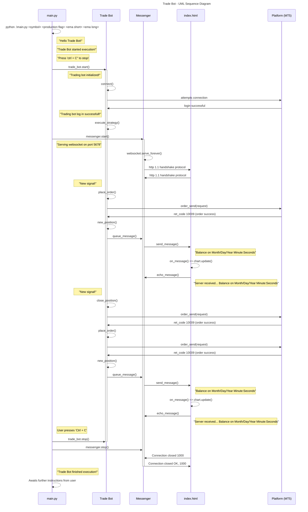

```mermaid
---
title: Trade Bot - UML Sequence Diagram
---
sequenceDiagram
participant main.py
participant Trade Bot
participant Messenger
participant index.html
participant Platform (MT5)

main.py -->> main.py: python .\main.py <symbol> <production flag> <ema short> <ema long>
Note right of main.py: "Hello Trade Bot!"
Note right of main.py: "Trade Bot started execution!"
Note right of main.py: "Press 'ctrl + C" to stop!
main.py->>Trade Bot: trade_bot.start()
activate Trade Bot
Note left of Trade Bot: "Trading bot initialized!"
Trade Bot -->> Trade Bot: connect()
Trade Bot ->> Platform (MT5): attempts connection
Platform (MT5) ->> Trade Bot: login successful
Note left of Trade Bot: "Trading bot log in successfull!"
Trade Bot -->> Trade Bot: execute_strategy()
main.py->>Messenger: messenger.start()
activate Messenger
Note right of main.py: "Serving websocket on port 5678"
Messenger -->> Messenger: websocket.serve_forever()
Messenger ->> index.html: http 1.1 handshake protocol
index.html ->> Messenger: http 1.1 handshake protocol
Note left of Trade Bot: "New signal!"
Trade Bot -->> Trade Bot: place_order()
Trade Bot ->> Platform (MT5): order_send(request)
Platform (MT5) ->> Trade Bot: ret_code 10009 (order success)
Trade Bot -->> Trade Bot: new_position()
Trade Bot ->> Messenger: queue_message()
Messenger ->> index.html: send_message()
Note right of index.html: "Balance on Month/Day/Year Minute:Seconds"
index.html -->> index.html: on_message() => chart.update() 
index.html ->> Messenger: echo_message()
Note right of index.html: "Server received... Balance on Month/Day/Year Minute:Seconds"
Note left of Trade Bot: "New signal!"
Trade Bot -->> Trade Bot: close_position()
Trade Bot ->> Platform (MT5): order_send(request)
Platform (MT5) ->> Trade Bot: ret_code 10009 (order success)
Trade Bot -->> Trade Bot: place_order()
Trade Bot ->> Platform (MT5): order_send(request)
Platform (MT5) ->> Trade Bot: ret_code 10009 (order success)
Trade Bot -->> Trade Bot: new_position()
Trade Bot ->> Messenger: queue_message()
Messenger ->> index.html: send_message()
Note right of index.html: "Balance on Month/Day/Year Minute:Seconds"
index.html -->> index.html: on_message() => chart.update() 
index.html ->> Messenger: echo_message()
Note right of index.html: "Server received... Balance on Month/Day/Year Minute:Seconds"
Note right of main.py: User presses 'Ctrl + C'
main.py ->> Trade Bot: trade_bot.stop()
deactivate Trade Bot 
main.py ->> Messenger: messenger.stop()
index.html ->> Messenger: Connection closed 1000
Messenger ->> index.html: Connection closed OK, 1000
deactivate Messenger
Note right of main.py: "Trade Bot finished execution!"
main.py -->> main.py: Awaits further instructions from user
```